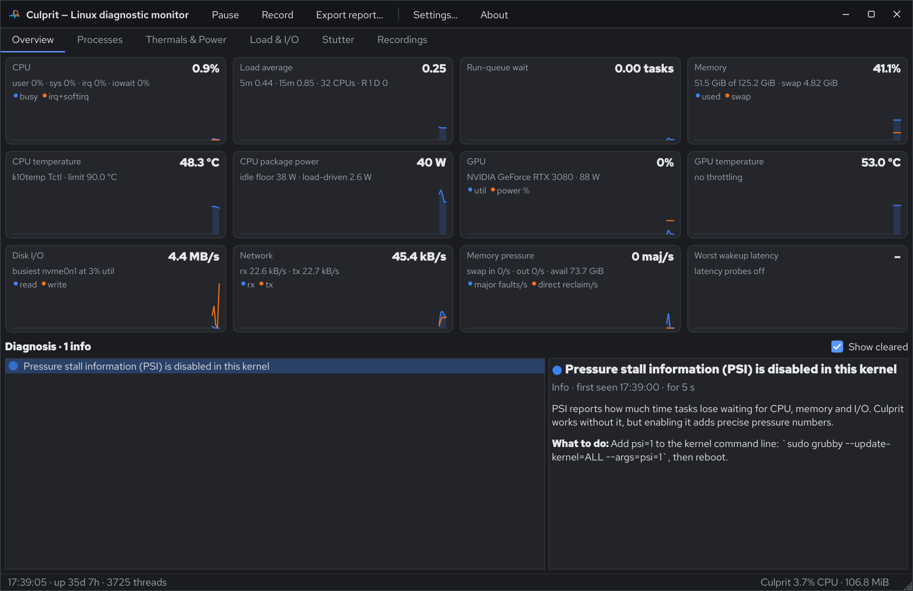
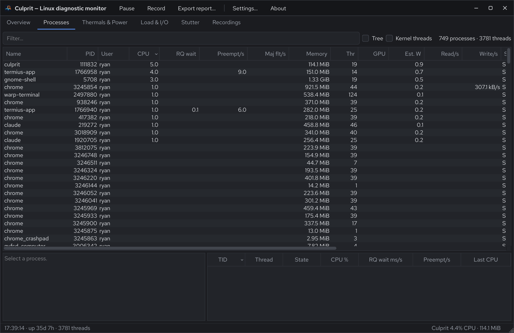
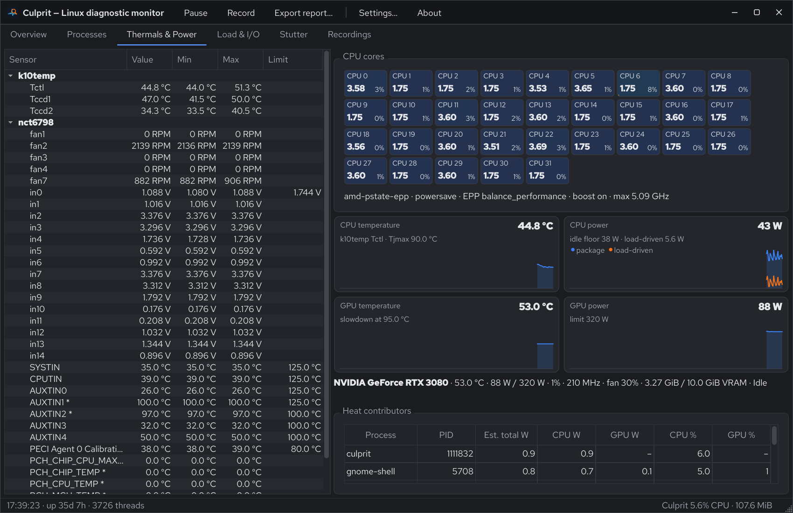

# Culprit

**Culprit** is a Linux system monitor built for *diagnosis*. Like a task
manager, it shows processes, CPU, memory, disks, sensors and the GPU. It also
tells you **why** the machine is loaded, hot or stuttering, and names the
process, IRQ, device or kernel subsystem responsible.

It is written in C++20 with Qt 6 Widgets. It needs no kernel modules and no
eBPF toolchain. It runs unprivileged, with an optional root helper for exact
scheduler tracing.



## Quick start

Packages for each release are on the
[releases page](https://github.com/ProjectHax/culprit/releases):

| Package | For | Install |
|---|---|---|
| `culprit_*_amd64.deb` | Ubuntu 22.04 or newer, Debian 12 or newer | `sudo apt install ./culprit_*_amd64.deb` |
| `culprit-*.el9.x86_64.rpm` | RHEL, AlmaLinux, Rocky 9 (with [EPEL](https://docs.fedoraproject.org/en-US/epel/)) and 10 | `sudo dnf install ./culprit-*.rpm` |
| `Culprit-*-x86_64.AppImage` | any x86-64 distribution from 2022 on | `chmod +x Culprit-*.AppImage && ./Culprit-*.AppImage` |

The .deb and the AppImage include Qt 6.10; the RPM uses your distribution's
Qt 6.6 or newer. To build from source:

```sh
./build.sh                   # builds with half of your CPU cores
./build/culprit              # GUI
./build/culprit --snapshot   # or: sample 3 s and print a diagnosis to the terminal
```

Hover over anything in the GUI (column headers, cards, sensor rows, status
lines) for an explanation of what it measures.

## What it answers

| Question | How Culprit answers it |
|---|---|
| *Why is the load average high?* | Splits load into runnable vs. uninterruptible (D-state) threads, and groups blocked threads by process and kernel wait channel ("9 threads of rsync blocked in `nfs_wait_bit_killable`"). |
| *Who is using the CPU, and who suffers?* | Per-process CPU plus **run-queue wait**, i.e. time spent runnable but waiting for a CPU, from per-thread schedstat. Oversubscription is reported with the causes (the biggest consumers) and the victims (the most-delayed processes). Single-CPU hotspots from pinning or affinity are reported separately. |
| *What is heating the machine?* | CPU package power (RAPL) above the idle floor is split across processes by CPU time × core frequency. GPU power above idle is split by per-process GPU utilization (NVML). It also reports thermal limits, clock drops, NVIDIA throttle reasons and fans that stopped while hot. |
| *Why does it micro-stutter?* | Latency probes measure how late a sleeping thread wakes up, and how much of that delay it spent on a run queue. Every hitch is analyzed against a 50 Hz "flight recorder" of per-CPU counters and classified: CPU contention (who ran), a late wakeup (IRQ/softirq storms, non-preemptible kernel work, firmware), direct reclaim/compaction, system-wide stalls, fork bursts or thermal throttling. Periodic stutter ("every 2.02 s") is detected too. |
| *…exactly which task/IRQ held the CPU?* | **Deep trace**, a root helper started through polkit, traces `sched_switch`, `sched_waking`, IRQs, softirqs, reclaim, compaction and block I/O. It reports each hitch's exact occupancy: "held CPU 7 for 4.1 ms: `kworker/7:1`, `IRQ 120 nvidia` 0.3 ms". |

Findings are listed with evidence, ranked suspects and advice. A finding
appears only after it persists, and clears only after it has been gone for a
while, so the list doesn't flicker.

## Build

Requirements:

- Qt ≥ 6.5 (Core, Gui, Widgets, DBus)
- CMake ≥ 3.21
- a C++20 compiler (GCC 12+ or Clang 15+)
- Linux ≥ 5.14 (≥ 6.x recommended)
- Optional at build time: `wayland-client` development files (found through
  pkg-config). They let *Automatic* title-bar mode ask the compositor whether
  it draws window decorations. Without them, Culprit guesses from
  `XDG_CURRENT_DESKTOP`.
- Optional at run time: the NVIDIA driver (NVML is loaded with `dlopen`),
  rtkit (real-time probes), polkit/pkexec (Deep trace).

```sh
./build.sh                          # configure (Ninja if available) + build
./build.sh --clean                  # from scratch
./build.sh --target culprit-helper  # extra arguments go to `cmake --build`
BUILD_TYPE=Debug ./build.sh         # default RelWithDebInfo
BUILD_DIR=build-dbg ./build.sh      # default build
```

The build uses **half of the logical CPU cores**. `build.sh` passes
`--parallel $(( $(nproc) / 2 ))`, and `cmake/Parallelism.cmake` defines Ninja
job pools and `CMAKE_AUTOGEN_PARALLEL` with the same limit. The cap therefore
also holds for a plain `cmake --build build` or `ninja -C build`. Override it
with `-DCULPRIT_JOBS=N`.

### Install

```sh
cmake -S . -B build -DCMAKE_INSTALL_PREFIX=/usr/local
./build.sh && sudo cmake --install build
```

This installs:

- `bin/culprit` and `libexec/culprit-helper`
- the polkit action `share/polkit-1/actions/org.culprit.helper.policy`
- the desktop entry and icon
- the systemd user unit `culprit-recorder.service`
- this README, the licenses and the `induce` test scripts under `share/doc/culprit`

Installing is optional. Everything, including Deep trace, also works from the
build directory.

### Packages

`packaging/ci/` builds the release packages; the
[Packages workflow](.github/workflows/packages.yml) runs it on every push. The
workflow installs and runs each package, and attaches all three to a GitHub
release when a `v*` tag is pushed. The tag must match the version in
`CMakeLists.txt`. The release notes are that version's section of
[CHANGELOG.md](CHANGELOG.md). To build a package locally, in a container of the target
distribution:

```sh
packaging/ci/deps.sh ubuntu                      # Ubuntu 22.04: build dependencies
packaging/ci/install-qt.sh 6.10.3 ~/qt           # Qt's official binaries + license texts
QT_ROOT_DIR=~/qt/6.10.3/gcc_64 packaging/ci/package.sh deb        # or appimage
packaging/ci/deps.sh alma && packaging/ci/package.sh rpm          # AlmaLinux 9 or 10
```

Packages land in `dist/`. The .deb and the AppImage bundle Qt from The Qt
Company's official binaries, because Ubuntu 22.04 ships only Qt 6.2. The .deb
keeps its copy in `/usr/lib/x86_64-linux-gnu/culprit`, separate from any
system Qt. `packaging/bundle-notices.py` lists every bundled component with its
license in `THIRD-PARTY-BUNDLED.txt`, using Qt's SBOM files and the license
texts from Qt's sources.

## Using the GUI

| Tab | What it shows |
|---|---|
| **Overview** | Live cards (CPU, load, run-queue wait, memory, CPU/GPU temperature and power, disks, network, memory pressure, worst wakeup latency) and the *Diagnosis* panel. Click a card to jump to the tab with the details. |
| **Processes** | Tree or flat view with CPU, run-queue wait, preemptions/s, major faults/s, memory, GPU, estimated watts, I/O, state and systemd unit. Selecting a process shows its details and threads. The context menu offers terminate/kill/stop/continue, nice, I/O priority and CPU affinity (applied to every thread, with a pkexec retry when permission is denied) and *Diagnose stutter for this process*. |
| **Thermals & Power** | Per-core heatmap (utilization, GHz, run-queue contention, IRQ share), frequency policy, all hwmon sensors with session min/max, CPU/GPU temperature and power graphs, GPU clock limiters, and the heat-contributors table. |
| **Load & I/O** | Load composition, and tables for per-CPU load, blocked (D) threads with wait channel and kernel stack, disks (utilization, IOPS, await), interrupts, softirqs, cgroup CPU-quota and memory.high throttling, and network. |
| **Stutter** | Live probe-latency graph with the threshold, the hitch list with a per-hitch explanation, probe mode, threshold and window, the Deep trace toggle (run-queue waiters and a kernel event log), and a focus-process line. |
| **Recordings** | Open recordings, replay them on a timeline with hitches and findings, and export text or JSON reports. |

| Processes | Thermals & Power |
|---|---|
|  |  |

| Action | Shortcut |
|---|---|
| Pause (freezes the display and sampling) | Space |
| Record | Ctrl+R |
| Export report… | Ctrl+E |
| Settings… | Ctrl+, |
| About (version, copyright, licenses) | |

### Sensors marked with `*`

On the Thermals tab, a `*` after a temperature sensor's name means it is
**probably not connected**. The channel either reads 0 °C, or it reads 90 °C
or more while the CPU is at least 10 °C cooler, which a board sensor can't do.
Super-I/O chips such as the nct67xx family report every thermistor input
whether or not anything is wired to it. An unused input floats to a
near-maximum value, for example an `AUXTIN` channel for an empty `T_SENSOR`
header. Hover over the row for the reading that triggered the mark. The mark
stays for the rest of the session.

## Command line

`culprit` is also a headless tool. Options that don't start the GUI never
create a window, so they work over SSH.

| Option | Effect |
|---|---|
| *(none)* | Start the GUI. |
| `--version` | Print the version and copyright. |
| `--tab NAME` | Start on a tab: `overview`, `processes`, `thermals`, `load`, `stutter` or `recordings`. |
| `--probe-mode MODE` | Stutter probes for this run: `off`, `floating`, `percpu` or `rt`. |
| `--snapshot [--seconds N] [--json]` | Sample for N seconds (default 3), print a diagnosis and exit. |
| `--record [--out DIR] [--duration S] [--deep]` | Record in the background until Ctrl+C / SIGTERM, or for S seconds. `--deep` also runs the root helper (via pkexec unless already root). |
| `--report FILE [--json]` | Print a report for a recording and exit. |
| `--open FILE` | Open a recording in the Recordings tab. |
| `--grab FILE.png [--seconds N]` | Save a screenshot of the window after N seconds and exit (useful with `QT_QPA_PLATFORM=offscreen`). |

## Settings

Settings are stored in `~/.config/culprit/culprit.conf` and edited under
**Settings…** (Ctrl+,). *Restore defaults* resets the dialog.

| Group | Setting | Default |
|---|---|---|
| Appearance | Theme: Automatic, Light or Dark | Automatic |
| | Title bar: Automatic, Culprit's own or System | Automatic |
| Sampling | Update interval | 1000 ms |
| | Processes scanned per thread (the busiest processes get exact per-thread run-queue wait) | 40 |
| Stutter detection | Probe mode | Floating probes |
| | Floating probes | 4 |
| | Hitch threshold: floating / per-CPU / kernel latency | 2 / 4 / 0.5 ms |
| Diagnosis | CPU temperature limit (Tjmax) | auto-detected from the CPU model |
| | Report processes using ≥ N cores, sustained for S seconds | 0.9 cores, 10 s |
| | Warn when the CPU is above | 80 °C |
| | Show a finding after / clear it after | 2 / 5 evaluations |
| Recordings | Directory | `~/.local/share/culprit/recordings` |

The same file also stores the learned CPU idle power floor
(`power/idleFloorW`). It is used to attribute package power on AMD CPUs (see
[Limitations](#limitations)).

## Appearance and scaling

**Theme: Automatic, Light or Dark.** Culprit uses its own light and dark
themes on top of Qt's Fusion style, so it looks the same on every desktop. In
*Automatic* mode it follows the desktop's dark-mode setting and switches live
when you change it. The sources, most authoritative first:

1. the desktop portal's `org.freedesktop.appearance color-scheme` (GNOME, KDE,
   COSMIC, Cinnamon, most wlroots setups), with live updates;
2. KDE's `kdeglobals` colors;
3. GNOME, Budgie, Cinnamon and MATE settings (`color-scheme`, GTK theme name);
4. XFCE's xsettings theme;
5. `GTK_THEME` and the `gtk-4.0`/`gtk-3.0` `settings.ini` files;
6. Qt's own hint, then the system palette.

Hover over the Theme setting to see which source was used, or set
`CULPRIT_DEBUG_THEME=1` to print it.

**Title bar: Automatic, Culprit's own, or System.** On Wayland compositors that
don't draw title bars for apps (GNOME/Mutter, Weston), Qt draws a fallback
title bar itself. That fallback is drawn in physical pixels, so with
`QT_SCALE_FACTOR` it ends up smaller than the rest of the window. In that case
*Automatic* uses Culprit's own integrated title bar: icon, title, the toolbar
actions and window buttons. It scales with the UI and still hands moving,
resizing, snapping and tiling to the compositor. On compositors that provide
server-side decorations (KDE, wlroots) and on X11, *Automatic* keeps the
system title bar. The choice is made by asking the compositor whether it
supports `xdg-decoration`.

Culprit honors `QT_SCALE_FACTOR` and Wayland fractional scaling; all custom
drawing is resolution-independent.

## Deep trace (root helper)

Clicking **Deep trace…** on the Stutter tab starts `culprit-helper` through
`pkexec`, so you are asked for your password. The GUI looks for the helper
next to the `culprit` binary, then in `../libexec`, then in the configured
libexec directory. Root can't read inside a running AppImage, so the AppImage
first copies the helper to `$XDG_RUNTIME_DIR` and deletes the copy when the
helper exits. The helper:

- records scheduler, IRQ, softirq, reclaim, compaction and block tracepoints
  with `perf_event_open`, using one ring buffer per CPU and `CLOCK_MONOTONIC`
  timestamps that line up with the probes;
- keeps a 5-second per-CPU occupancy timeline, so the GUI can ask what ran on
  CPU *c* between *t0* and *t1* for every hitch;
- reports long run-queue waits with their blockers, long IRQ/softirq handlers,
  reclaim/compaction stalls, slow block requests, per-second top waiters and
  latency histograms;
- reads what only root can see: kernel stacks and wait channels of D-state
  threads, and per-process I/O of every user;
- temporarily enables `kernel.task_delayacct` (per-process block-I/O delay).
  The original value is restored on exit, and after a crash or `kill -9` on
  the next start.

Security design:

- The helper is plain C++ with no Qt, and is built with stack protector,
  `_FORTIFY_SOURCE=3`, PIE and full RELRO.
- It accepts only a small whitelist of line commands, never file paths.
- Every string it emits, such as attacker-controlled thread names, is JSON
  escaped.
- It only writes two whitelisted sysctls (`kernel.task_delayacct` and
  `kernel.sched_schedstats`), and exits when the GUI closes its stdin.
- The installed polkit action names only the installed, root-owned helper
  path, and requires `auth_admin` every time.

Running Deep trace from the build directory makes root execute a binary that
your user can modify. That is fine on a development machine; install Culprit
for everyday use.

To check tracing end to end:

```sh
sudo ./build/culprit-helper --selftest
```

It pins a busy "hog" thread and a sleeping "victim" to one CPU and verifies
that the victim's run-queue waits are attributed to the hog. It also checks
that a hostile thread name can't break the protocol and that the sysctl round
trip restores the original value.

## Background recording

```sh
systemctl --user enable --now culprit-recorder   # after installing
# or, without installing:
./build/culprit --record                         # Ctrl+C to stop
```

A recording is a JSON-lines file in `~/.local/share/culprit/recordings` (or
the directory from Settings or `--out`). It holds a header, a compact 1 Hz
summary with the top processes, every hitch (and its deep-trace update) and
finding transitions. Files rotate at 64 MiB. Open one in the **Recordings**
tab, or run `culprit --report FILE`.

## How stutter detection works

1. **Latency probes.** Threads sleep until an absolute 1 ms deadline with 1 ns
   timer slack. On waking, each records how late it is, and reads its own
   `/proc/thread-self/schedstat` to learn how much of that time it spent
   *runnable on a run queue*. If most of the delay was run-queue time, another
   task held the CPU. If little was, the wakeup itself was late: interrupts,
   softirqs, non-preemptible kernel code or firmware.
   - *Floating probes* (default): 4 probes placed by the scheduler, like an
     app's threads. Threshold 2 ms.
   - *Per-CPU sweep*: one probe pinned to every CPU, to find the stalling CPU.
     Threshold 4 ms, which is above EEVDF's ~3 ms base slice; waiting one
     slice behind a busy task is normal fair scheduling.
   - *Kernel latency (RT)*: SCHED_FIFO probes granted by rtkit, so only
     IRQ/kernel/firmware delay remains.
2. **Flight recorder.** A 10-second ring of cheap per-CPU counters at 25–50 Hz
   (`/proc/schedstat`, `/proc/stat`, softirqs, vmstat, runnable/blocked
   counts, fork counter, CPU temperature, per-core frequency, GPU clock
   reasons) and, at 5 Hz, IRQ lines and the busiest processes' CPU time.
3. **Analysis.** Each hitch's surrounding window (−600 ms … +200 ms) is
   compared with the baseline before it. The analyzer ranks suspects: who ran
   on the stalled CPU, IRQ lines and softirq vectors above baseline,
   reclaim/compaction counters, fork bursts, blocked tasks, thermal limit or
   clock collapse, and GPU throttling. Several CPUs stalling at once point to
   SMIs/firmware or stop_machine. Episodes repeating on a fixed period point
   to something polling on a timer.
4. With **Deep trace** on, each hitch additionally gets the exact occupancy of
   its CPU from the helper.

Culprit's own slow sensor reads are recorded. A hitch that coincides with one
is labelled self-inflicted, and Culprit's own threads are never blamed as
suspects.

## Getting more out of the kernel

- **PSI** (pressure stall information) is compiled into most distribution
  kernels but may be disabled at boot. Enable it with
  `sudo grubby --update-kernel=ALL --args=psi=1` (or add `psi=1` to the kernel
  command line) and reboot. Culprit then shows CPU, memory and I/O pressure.
  Leaving PSI on costs very little.
- **Real-time probes** need `rtkit-daemon`, which is present on most desktops.
- The *Block I/O wait* line in a process's details needs
  `kernel.task_delayacct=1`; Deep trace enables it while it runs.

## Troubleshooting

| Symptom | Cause / fix |
|---|---|
| Deep trace says authentication was cancelled or failed | pkexec exited with 126 or 127. Make sure a polkit authentication agent is running in your session; every major desktop starts one. |
| No GPU cards or GPU columns | NVML (`libnvidia-ml.so.1`) wasn't found. Only NVIDIA GPUs are supported. |
| "RAPL not readable" | The powercap energy counters (`/sys/class/powercap/intel-rapl:*` or `amd-rapl:*`) are missing, or readable only by root on this kernel. |
| The title bar looks too small or appears twice | Pick *Culprit's own* or *System* under Settings → Appearance → Title bar. |
| The theme doesn't follow the desktop | Run with `CULPRIT_DEBUG_THEME=1` to see which source was read, or pick Light or Dark explicitly. |
| Culprit itself seems slow | Run with `CULPRIT_DEBUG_TIMING=1` to print per-stage timings. |

## Overhead

Measured on a 16-core / 32-thread desktop (~750 processes, ~3500 threads), as a
share of one CPU core:

| Component | Cost |
|---|---|
| Engine (full process scan with cached `/proc` fds, per-thread scan of the busiest processes, sensors, NVML, rules), 1 Hz | ≈1.5 % |
| Stutter detection (4 probes at 1 kHz + flight recorder) | ≈3 % |
| GUI | ≈1 % |

Culprit is niced (+5). Super-I/O sensor chips (nct67xx, it87, …) cost about
70 ms of kernel time per refresh, so they are polled on a separate thread
every 30 s, or every 5 s while the Thermals tab is open. Culprit's own CPU and
memory use are always shown in the status bar.

## Reproducing problems

`tools/induce/` contains scripts that create each kind of problem, used to
verify the diagnosis:

| Script | Expected result |
|---|---|
| `cpu_hog.sh [N] [S]` | "CPU oversubscribed", hitches classified as CPU contention |
| `pinned_hog.sh [CPU]` | "CPU N is congested while other CPUs are free" |
| `periodic_burst.sh [P]` | "Periodic stutter every P s", fork-burst evidence |
| `rt_burst.sh [CPU]` (sudo) | real-time task finding, periodic ~50 ms stalls |
| `io_hog.sh [S]` | disk throughput, `dd` in D state (`__iomap_dio_rw`), encryption kworkers as heat source on LUKS |
| `mem_high.sh` | "… throttled at its memory.high limit", swapping with the faulting process first |
| `cpu_quota.sh` | "… throttled by its CPU quota" |
| `udp_flood.py` | NET_RX softirq load in Load & I/O |

## Limitations

- GPU metrics come from NVML, so they are NVIDIA only; AMD and Intel GPUs are
  not shown yet.
- Power attribution is an estimate. On AMD, the RAPL "core" zone reports only
  the reading core, so Culprit attributes package power above the idle floor
  it learns (and persists) instead.
- Without Deep trace, wait channels and I/O of other users' processes are
  hidden by the kernel, and stalls caused by very short-lived tasks can only
  be attributed statistically (as fork bursts).
- Hitch analysis is heuristic evidence ranking. Deep trace provides the
  authoritative answer.
- The "probably not connected" sensor mark is a heuristic too. A genuinely
  hot board sensor, such as a VRM under sustained heavy load, can be marked.

## Source layout

```
src/common/   pure C++20, shared with the helper: procfs/sysfs parsers, cached fds,
              tracefs format parser, JSON writer, SPSC ring
src/core/     QtCore: Engine, collectors (system, processes, hwmon, RAPL, NVML, cgroups),
              stutter (probes, flight recorder, hitch analyzer), analysis (rule engine,
              power attribution), helper client, recorder, reports, process actions, settings
src/gui/      Qt Widgets: main window, theme, tabs, models, custom QPainter widgets
src/helper/   culprit-helper: perf_event_open tracer, scheduler/IRQ tracker, privileged /proc
packaging/    polkit action, desktop entry, icon, systemd user unit, Debian copyright,
              third-party notices generator, CI package scripts (packaging/ci/)
tools/induce/ problem generators for verification
cmake/        half-core build cap, CPack settings, Qt bundling for the .deb
licenses/     license texts of third-party software (LGPL-3.0 for Qt)
docs/         screenshots used in this README
.github/      GitHub Actions workflow that builds the .deb, .rpm and AppImage
```

## License

Copyright (C) 2026 ProjectHax LLC

Culprit is free software: you can redistribute it and/or modify it under the
terms of the GNU General Public License as published by the Free Software
Foundation, either version 3 of the License, or (at your option) any later
version. It is distributed in the hope that it will be useful, but WITHOUT
ANY WARRANTY; without even the implied warranty of MERCHANTABILITY or FITNESS
FOR A PARTICULAR PURPOSE. See [LICENSE](LICENSE) for the full text.

Culprit uses Qt under the LGPL-3.0 and a few other libraries.
[THIRD-PARTY-NOTICES.md](THIRD-PARTY-NOTICES.md) lists them with their
licenses. The About dialog shows the same information, plus the notices for
every library bundled in the .deb or AppImage.
